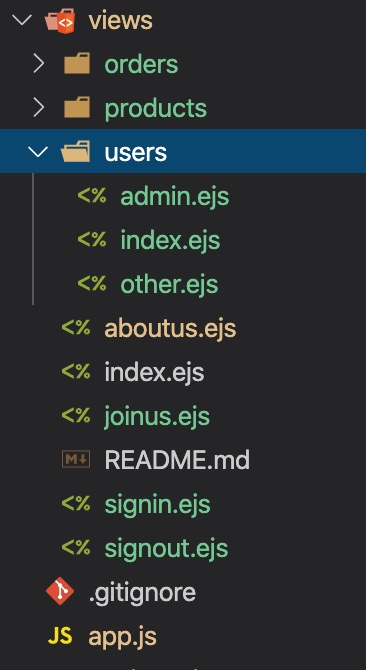

# 总结常用的一些类库  

## 1. JS模板引擎  

1.1 [handlebars.js](https://handlebarsjs.com/zh/)  
1.2 [ejs.js](https://ejs.bootcss.com/)  
> 服务端和客户端都可以，捕获异常准确调试方便  

1.3 [art-template.js](https://aui.github.io/art-template/zh-cn/index.html)  
> 分客户端（兼容IE8+，IE8需要加补丁），node端：express、koa，webpack端  

## 2. JS库  

### 1. [jQuery](https://jquery.com/)，[zepto.js](http://www.zeptojs.cn/)  

> jQuery兼容许多老浏览器版本，1.x兼容到IE6，2.x只是相较于1.x移除了IE6/7/8的兼容，3.x相较于2.x增加了许多新特性。可以参照[jQuery - 不同版本的差异汇总（版本选择建议](https://www.hangge.com/blog/cache/detail_2228.html)、[jQuery - jQuery3的新特性汇总（附样例）](https://www.hangge.com/blog/cache/detail_2235.html)  
> zepto相较于jQuery，则是针对Chrome和safria，更加轻量  
> [jquery-validation](https://jqueryvalidation.org/documentation/)表单验证插件。(jQuery, tested with 1.7.2, 1.8.3, 1.9.1, 1.11.1, 3.1.1)

### 2. [backbone.js](http://www.zeptojs.cn/)  

> MVC前端框架[Backbone.js入门教程第二版](https://github.com/the5fire/backbonejs-learning-note)  

### 3. [popper.js](https://popper.js.org/)  

> 元素定位类库，许多UI框架都在使用。

## koa2  

### 模板引擎  

koa-views,koa-swig,ejs,handlebars,art-template  
模板引擎也分服务端和客户端，node端得搭配koa-views、koa-swig、koa-ejs等使用。这里只讲koa-views@6.2.1使用中路径问题,其内部使用get-paths(path, relPath, extension)这个库解析路径。



``` js  
const Koa = require("koa");
const Router = require("@koa/router");
const router = new Router();
const views = require("koa-views");
const app = new Koa();
// views方法第一个参数就是get-paths接收的第一个参数，还可以是绝/相对路径，extension就是第三个参数。路由中render的第一个参数就是get-paths第二个参数(这是个坑，不是路径,可以有后缀名)。解析到文件会找下面的index文件。
app.use(views('views', {
    extension: "ejs"
}));
router.get("/users", async (ctx, next) => {
    await ctx.render("users", {
        title: "用户管理"
    })
});
router.get("/users/admin", async (ctx, next) => {
    await ctx.render('users/admin', {
        title: "admin"
    })
});
```

ejs  

> 服务端：npm i ejs  
> 客户端：Go to the [Latest Release](https://github.com/mde/ejs/releases/latest), download
`./ejs.js` or `./ejs.min.js`. Alternately, you can compile it yourself by cloning
the repository and running `jake build` (or `$(npm bin)/jake build` if jake is
not installed globally).也可以`npx jake buld`

### 静态文件  

koa-static，koa-static-cache  

## 打包工具  

### [webpack](https://www.webpackjs.com/)  

### [parceljs](https://parceljs.org/)  

### [gulp v4.x](https://www.gulpjs.com.cn/)  

### [Rollup.js](https://www.rollupjs.com/)  

## node  

### [dotenv](https://www.npmjs.com/package/dotenv)  

识别文件(.env)中的变量，并添加到process.env中  

### 数据库  

#### [sequelize](https://github.com/demopark/sequelize-docs-Zh-CN)  

Sequelize 是一个基于 promise 的 Node.js ORM, 目前支持 Postgres, MySQL, SQLite 和 Microsoft SQL Server. 它具有强大的事务支持, 关联关系, 预读和延迟加载,读取复制等功能.

### node端生成、操作DOM[jsdom](https://www.npmjs.com/package/jsdom)

## 富文本编辑器  

### [tinymce](https://www.tiny.cloud/docs/)（无依赖）  

### [ckeditor](https://ckeditor.com/)（无依赖）  

### [draft.js](https://draftjs.org/docs/getting-started)（react，facebook开源）  

### [Lin CMS](http://doc.cms.7yue.pro/)  

可以用koa、flask、spring-boot搭建  

## [popper.js弹窗](https://popper.js.org/)
